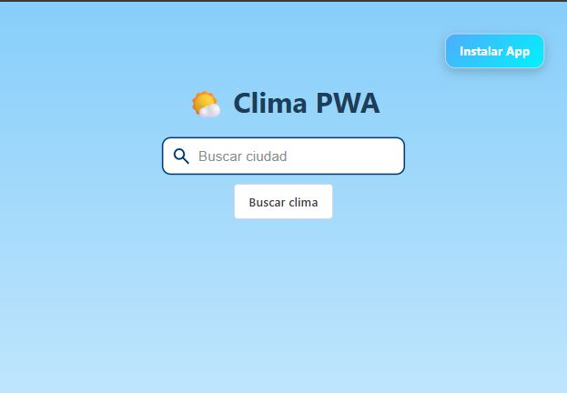

# 🌤️ Clima PWA



## Descripción

Clima PWA es una **Progressive Web App** que permite consultar el clima de cualquier ciudad de manera rápida y sencilla, incluso **funcionando offline** gracias al **Service Worker** y al cache dinámico. La app está desarrollada con:

- **TypeScript** para componentes Web con `LitElement`.
- **Shoelace Components** para botones, inputs y tarjetas estilizadas.
- **Vite** como bundler y servidor de desarrollo.
- **OpenWeatherMap API** para obtener información del clima.
- Funcionalidades PWA completas: manifest, service worker, instalación.


Puedes ver la app desplegada en Netlify aquí: [Clima PWA](https://playful-granita-c0e638.netlify.app/)

---

## Características

- Buscar ciudades y mostrar temperatura, condición climática y más.
- Cache dinámico de las ciudades consultadas para funcionar offline.
- Instalación como PWA con botón de "Instalar App".
- Diseño moderno y responsive con Shoelace Components.
- Compatibilidad con navegadores modernos (Chrome, Brave, Edge, Firefox).

---

## Tecnologías

- HTML5 / CSS3
- TypeScript
- [Lit](https://lit.dev/) para Web Components
- [Shoelace](https://shoelace.style/)
- [Vite](https://vitejs.dev/)
- OpenWeatherMap API
- Service Worker y manifest.json para PWA

---

## Instalación

Clona el proyecto:

```bash
git clone https://github.com/tu-usuario/clima-pwa.git
cd clima-pwa
```

Instala las dependencias:

```bash
npm install
```

### Desarrollo local

Para correr el proyecto en desarrollo con recarga en caliente:

```bash
npm run dev
```

Esto abrirá la app en `http://localhost:5173` o el puerto que Vite indique.

### Build para producción

Para generar la versión optimizada lista para desplegar:

```bash
npm run build
```

El contenido se generará en la carpeta `dist/`.

### Previsualizar producción localmente

```bash
npm run preview
```

---

## Estructura del proyecto

```
clima-pwa/
│
├─ dist/                   # Carpeta generada por Vite para producción
├─ src/
│  ├─ components/          # Web Components TypeScript
│  │  └─ espe-search-input.ts
│  ├─ css/
│  │  └─ style.css
│  ├─ js/
│  │  ├─ app.js
│  │  └─ ui.js
│  └─ main.ts              # Entry point que importa los componentes
├─ index.html
├─ package.json
├─ tsconfig.json
└─ manifest.json
```

---

## Uso

1. Ingresa el nombre de la ciudad en el campo de búsqueda.
2. Presiona **Buscar clima** o `Enter`.
3. El clima de la ciudad se mostrará en una **tarjeta estilizada**.
4. Si la app está instalada como PWA, también podrás buscar ciudades **sin conexión**.

---

## Cómo funciona la instalación PWA

- Cuando la app detecta que puede instalarse, muestra un **botón de instalar**.
- Al hacer clic, se activa la instalación nativa en el dispositivo.
- La app funciona offline gracias al **Service Worker** y cache dinámico.

---

## Dependencias

- `lit` ^3.x
- `typescript` ^5.x
- `vite` ^7.x
- `@shoelace-style/shoelace` ^2.x

---

## Licencia

MIT © Andrés Pantoja

---


